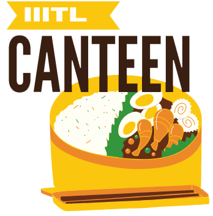

# IIITL Canteen App



## Project Overview:

The IIITL Canteen App is a mobile application designed to streamline the canteen experience for students at IIIT Lucknow. The app aims to reduce wait times by allowing users to place orders in advance, providing a more efficient and convenient way to access canteen services.

---

## Features:

### 1. **User Authentication:**
   - Secure user authentication using Firebase Authentication.
   - Support for email/password, phone number, and third-party provider sign-ins.

### 2. **Real-Time Order Tracking:**
   - Real-time updates on order status and details.
   - Instant synchronization of order data across devices.

### 3. **Product Browsing:**
   - Browse and view details of available canteen products.
   - User-friendly interface for effortless product exploration.

### 4. **Efficient Cart Management:**
   - Add products to the cart with quantity selection.
   - Real-time cart updates and total price calculation.

### 5. **Order History:**
   - View a comprehensive history of past orders.
   - Access order details, including order ID, date, total amount, and status.

### 6. **Image Slider:**
   - Engaging image slider on the home screen for promotional content.
   - Utilizes a custom PagerAdapter for smooth image transitions.

### 7. **Firebase Services Integration:**
   - Firebase Realtime Database for synchronized and scalable data storage.
   - Firestore for structured data storage.
   - Firebase Cloud Storage for secure object storage.
   - Firebase Analytics for user engagement insights.

### 8. **User-Friendly UI/UX:**
   - Intuitive navigation with a bottom navigation bar.
   - Responsive and aesthetically pleasing design.

### 9. **External Libraries:**
   - Integration of external libraries like Gson, Country Code Picker, TastyToast, and Picasso for enhanced functionality and visual appeal.

---

## Tech Stack:

- **Android Development Stack:**
  - Language: Java
  - Android SDK: 31
  - AndroidX Libraries: AppCompat, Material Design, ConstraintLayout, Legacy Support
  - Firebase Services: Analytics, Authentication, Realtime Database, Firestore, Cloud Storage
  - External Libraries: Gson, Country Code Picker, TastyToast, Picasso, Google Play Services Location
  - Testing Dependencies: JUnit, Espresso

- **Build System:**
  - Gradle

---

## Build Instructions:

1. Clone the repository.
   ```bash
   git clone https://github.com/your-username/IIITL-Canteen-App.git
